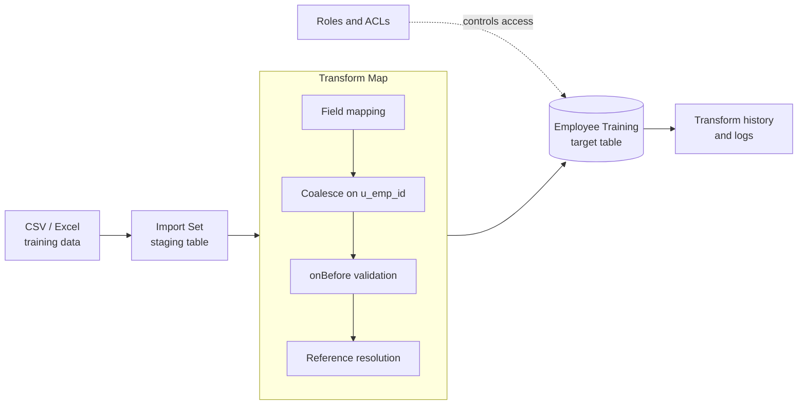

# Import Data using Transform Maps

> A ServiceNow project that imports employee training data through **Import Sets** and **Transform Maps**, resolves related records with **dot-walking**, and protects the result with **user roles** and **ACL-based access control**.


---

## Table of Contents

1. [Overview](#overview)
2. [Key Features](#key-features)
3. [Architecture](#architecture)
4. [Tech Stack](#tech-stack)
5. [Data Model](#data-model)
6. [Roles and Access Control](#roles-and-access-control)
7. [Getting Started](#getting-started)
8. [Import Workflow](#import-workflow)
9. [Transform Map Configuration](#transform-map-configuration)
10. [Dot-Walking Examples](#dot-walking-examples)
11. [ACL Configuration](#acl-configuration)
12. [Testing](#testing)
13. [Troubleshooting](#troubleshooting)
14. [Project Planning](#project-planning)
15. [Future Scope](#future-scope)
16. [Contributing](#contributing)

---

## Overview

Organizations that load employee data into ServiceNow from CSV or Excel files often run into duplicate records, inconsistent formatting, incorrect field mappings and broken reference fields. Training records add a further concern: they are tied to individual employees, so **who can see and change them matters** as much as how they are loaded.

This project provides a controlled, repeatable workflow for bulk onboarding of employee training records:

- Source files are staged in an **Import Set** instead of being written straight to the target table.
- A **Transform Map** maps, validates and deduplicates records on the way in.
- **Dot-walking** resolves related data such as the employee, their department and their manager.
- **Roles and ACLs** make sure each person only sees and edits the records they should.

## Key Features

| Feature | What it does |
|---|---|
| **Controlled staging** | Source data lands in an Import Set table first, separating raw input from target records. |
| **Field mapping** | A Transform Map maps source columns to target fields systematically. |
| **Duplicate handling** | A **Coalesce** key (`u_emp_id`) updates existing records instead of creating duplicates. |
| **Validation** | `onBefore` transform scripts reject missing or invalid values before they reach the target table. |
| **Reference resolution** | Employee, department and manager references are resolved during transformation. |
| **Dot-walking** | Related fields are read through reference fields, e.g. `employee.department.name`. |
| **Role-based access** | Dedicated roles separate administrators, managers and employees. |
| **ACL security** | Table-level and field-level ACLs enforce who can read, write, create and delete. |
| **Auditability** | Transform history and logs show what was imported, updated or skipped. |

## Architecture



The architecture keeps the Import Set as a staging layer between the source file and the target table. The Transform Map is the single place where mapping, deduplication, validation and reference lookups happen, and ACLs govern every read and write on the target data.

## Tech Stack

| Component | Purpose |
|---|---|
| ServiceNow platform | Import Sets, Transform Maps, target tables, access control |
| Import Sets | Temporary staging area for imported source data |
| Transform Maps | Map and transform source data into target records |
| ServiceNow server-side JavaScript | Validation and transformation scripting |
| Coalesce | Duplicate detection and record matching |
| Reference fields and dot-walking | Resolve related records such as users and departments |
| Roles and ACLs | Role-based access control for secure data handling |
| CSV / Excel | Source format for bulk import |

## Data Model

> The table, field and role names below are the conventions used in this project. Adjust them to match your instance's naming standards.

### Target table: `u_employee_training`

| Field | Column | Type | Notes |
|---|---|---|---|
| Employee ID | `u_emp_id` | String | **Coalesce key.** Unique per training record owner. |
| Employee | `u_employee` | Reference to `sys_user` | Resolved from the employee ID during transformation. |
| Course Name | `u_course_name` | String | Required. |
| Training Category | `u_category` | Choice | For example Compliance, Technical, Soft Skills. |
| Completion Date | `u_completion_date` | Date | Must be a valid date. |
| Status | `u_status` | Choice | For example Not Started, In Progress, Completed. |
| Score | `u_score` | Integer | Restricted by a field-level ACL. |
| Notes | `u_notes` | String | Restricted by a field-level ACL. |

### Related tables used through dot-walking

| Table | Used for |
|---|---|
| `sys_user` | Employee identity, manager and contact details |
| `cmn_department` | Department of the employee (`u_employee.department`) |

## Roles and Access Control

### Roles

| Role | Intended users | Summary |
|---|---|---|
| `u_training_admin` | Training and HR administrators | Full control, including imports. |
| `u_training_manager` | People managers | Read and update records for their direct reports. |
| `u_training_employee` | All employees | Read their own training records only. |

### Permission matrix

| Operation | `u_training_admin` | `u_training_manager` | `u_training_employee` |
|---|:---:|:---:|:---:|
| Run data imports / transforms | Yes | No | No |
| Create records | Yes | No | No |
| Read records | All | Direct reports | Own only |
| Update records | All | Direct reports (limited fields) | No |
| Delete records | Yes | No | No |
| Read / write `u_score`, `u_notes` | Read and write | Read only | No access |

Roles are assigned to users or groups, and ACLs reference the roles. This keeps access manageable as people join, move and leave.

## Getting Started

### Prerequisites

- A ServiceNow instance (a Personal Developer Instance works for development)
- An account with `admin` or equivalent rights to create tables, roles, ACLs and transform maps
- A CSV or Excel file with the training data (see [Source file format](#source-file-format))

### Setup steps

1. **Create the target table** `u_employee_training` with the fields listed in the [Data Model](#data-model).
2. **Create the roles** `u_training_admin`, `u_training_manager` and `u_training_employee`.
3. **Create the ACLs** described in [ACL Configuration](#acl-configuration).
4. **Create the Import Set table** by loading a sample file (**System Import Sets > Load Data**).
5. **Create the Transform Map** from the Import Set table to `u_employee_training` and configure the mappings.
6. **Add the `onBefore` script** to validate rows and resolve references.
7. **Assign roles** to test users and run the [tests](#testing).

### Source file format

| `emp_id` | `course_name` | `category` | `completion_date` | `status` | `score` |
|---|---|---|---|---|---|
| E1001 | Data Privacy Basics | Compliance | 2026-08-14 | Completed | 92 |
| E1002 | Secure Coding | Technical | 2026-09-02 | In Progress | |

Use a header row, one record per line and ISO dates (`YYYY-MM-DD`).

## Import Workflow

1. **Prepare source data.** Clean the file, confirm the header row and use consistent formats.
2. **Create the Import Set.** Go to **System Import Sets > Load Data** and choose the target Import Set table.
3. **Load the source data.** Upload the CSV/Excel file and check the staged rows.
4. **Run the Transform Map.** Select **Transform** on the Import Set and pick the map.
5. **Review the results.** Open the transform history and logs to see inserted, updated, skipped and errored rows.
6. **Verify the target records.** Open `u_employee_training` and check the data, references and counts.

## Transform Map Configuration

### Field mappings

| Source field | Target field | Notes |
|---|---|---|
| `u_emp_id` | `u_emp_id` | **Coalesce = true** |
| `u_course_name` | `u_course_name` | Required by validation |
| `u_category` | `u_category` | Mapped to choice value |
| `u_completion_date` | `u_completion_date` | Validated as a date |
| `u_status` | `u_status` | Mapped to choice value |
| `u_score` | `u_score` | Optional integer |
| *(script)* | `u_employee` | Resolved in the `onBefore` script |

### Coalesce

Mark `u_emp_id` as the **Coalesce** field on the map. When an incoming row matches an existing record, the record is **updated** instead of a duplicate being inserted. If a single employee can have several trainings, add `u_course_name` as a second Coalesce field so each employee-and-course pair stays unique.

### `onBefore` validation script

```javascript
(function runTransformScript(source, map, log, target /*undefined onStart*/ ) {

    // 1. Required fields
    var empId = (source.u_emp_id + '').trim();
    var course = (source.u_course_name + '').trim();

    if (!empId || !course) {
        log.error('Row ' + source.sys_import_row + ': missing employee ID or course name.');
        ignore = true;           // skip this row
        return;
    }

    // 2. Date format check (YYYY-MM-DD)
    var dateStr = (source.u_completion_date + '').trim();
    if (dateStr && !/^\d{4}-\d{2}-\d{2}$/.test(dateStr)) {
        log.error('Row ' + source.sys_import_row + ': invalid completion date "' + dateStr + '".');
        ignore = true;
        return;
    }

    // 3. Resolve the employee reference
    var user = new GlideRecord('sys_user');
    user.addQuery('employee_number', empId);
    user.setLimit(1);
    user.query();

    if (user.next()) {
        target.u_employee = user.getUniqueValue();
    } else {
        log.warn('Row ' + source.sys_import_row + ': no user found for employee ID ' + empId + '.');
        ignore = true;           // avoid creating a record with a broken reference
    }

})(source, map, log, target);
```

## Dot-Walking Examples

Dot-walking follows reference fields to read data on related records without extra queries or joins.

**In a script**

```javascript
var gr = new GlideRecord('u_employee_training');
gr.addQuery('u_status', 'completed');
gr.query();
while (gr.next()) {
    gs.info(
        gr.u_employee.name + ' | ' +
        gr.u_employee.department.name + ' | ' +
        gr.u_employee.manager.name
    );
}
```

**In list filters and reports**

| Goal | Dot-walked path |
|---|---|
| Show the employee's department | `Employee > Department > Name` |
| Filter by the employee's manager | `Employee > Manager` |
| Group by department | `Employee > Department` |

**In an ACL condition**

```javascript
current.u_employee.manager == gs.getUserID()
```

## ACL Configuration

Create ACLs on `u_employee_training` for each operation. Always apply the most specific rule first, and keep a default-deny posture by not granting access beyond these rules.

| Operation | Type | Roles | Condition / script |
|---|---|---|---|
| `read` | Record (`u_employee_training`) | `u_training_admin`, `u_training_manager`, `u_training_employee` | Script below |
| `write` | Record | `u_training_admin`, `u_training_manager` | Script below |
| `create` | Record | `u_training_admin` | None |
| `delete` | Record | `u_training_admin` | None |
| `read` | Field (`u_employee_training.u_score`, `.u_notes`) | `u_training_admin`, `u_training_manager` | None |
| `write` | Field (`u_employee_training.u_score`, `.u_notes`) | `u_training_admin` | None |

**Read ACL script**

```javascript
answer = false;

if (gs.hasRole('u_training_admin')) {
    answer = true;
} else if (gs.hasRole('u_training_manager') &&
           current.u_employee.manager.toString() == gs.getUserID()) {
    answer = true;               // manager of the employee
} else if (current.u_employee.toString() == gs.getUserID()) {
    answer = true;               // the employee's own record
}
```

**Write ACL script**

```javascript
answer = false;

if (gs.hasRole('u_training_admin')) {
    answer = true;
} else if (gs.hasRole('u_training_manager') &&
           current.u_employee.manager.toString() == gs.getUserID()) {
    answer = true;
}
```

> **Tip:** Limit access to the Import Set table and the Transform Map to `u_training_admin` as well, so only authorized users can run imports.

## Testing

UAT covered the full import workflow, including security.

| Test area | Cases | Pass | Fail |
|---|---:|---:|---:|
| Source data / Import Set | 5 | 5 | 0 |
| Transform Map configuration | 5 | 5 | 0 |
| Field mapping and Coalesce | 4 | 4 | 0 |
| Data validation | 4 | 3 | 1 |
| Reference field handling | 3 | 3 | 0 |
| Target record verification | 4 | 4 | 0 |
| Error / exception handling | 3 | 3 | 0 |
| Security / access control | 2 | 2 | 0 |
| **Total** | **30** | **29** | **1** |

**Result:** 29 of 30 cases passed (96.7%). One validation case requires correction before final acceptance.

### Quick manual checks

- Import a file with a duplicate `u_emp_id` and confirm the record is **updated**, not duplicated.
- Import a row with a missing course name and confirm it is **skipped** and logged.
- Import a row with an unknown employee ID and confirm no record with a broken reference is created.
- Impersonate each role and confirm the [permission matrix](#permission-matrix) holds.

## Troubleshooting

| Symptom | Likely cause | Fix |
|---|---|---|
| Duplicate records after import | Coalesce field not set, or the key value differs in case or whitespace | Enable Coalesce on `u_emp_id` and trim values in the `onBefore` script. |
| `u_employee` is empty | Employee ID not found in `sys_user` | Check `employee_number` values, or adjust the lookup field. |
| Rows missing from target | `ignore = true` triggered by validation | Review the transform log for the row number and reason. |
| Date fields are blank or wrong | Date format differs from `YYYY-MM-DD` | Normalize dates in the source file or convert them in the script. |
| User sees no records | Missing role, or ACL script condition not met | Check role assignment and use **Impersonate User** to test. |
| Choice fields not set | Source text does not match choice labels | Align source values with choice labels or add a mapping script. |
| Large imports are slow | System performance limits on big batches | Split the file into smaller batches. |

## Project Planning

The work is organized into two Agile sprints using story-point estimation.

| Sprint | Focus | Story points |
|---|---|---:|
| Sprint 1 | Data Import and Data Transformation (USN1 to USN6) | 14 |
| Sprint 2 | Data Validation, Deployment and Verification (USN7 to USN12) | 16 |
| **Total** | | **30** |

Planned velocity: **30 story points / 2 sprints = 15 story points per sprint**.

## Future Scope

- Expand validation rules for more source-data formats
- Automate reference-field resolution further
- Add monitoring and reporting for large data batches
- Provide reusable Transform Map templates for other datasets
- Improve duplicate detection for complex datasets
- Extend automated testing for future Transform Map changes

## Contributing

1. Fork the repository and create a feature branch.
2. Make your changes and test them on a non-production instance.
3. Document any new tables, fields, roles or ACLs in this README.
4. Open a pull request describing what changed and why.

---

*Built on the ServiceNow platform. Data import, transformation, dot-walking, roles and ACLs working together to keep employee training records accurate and secure.*
